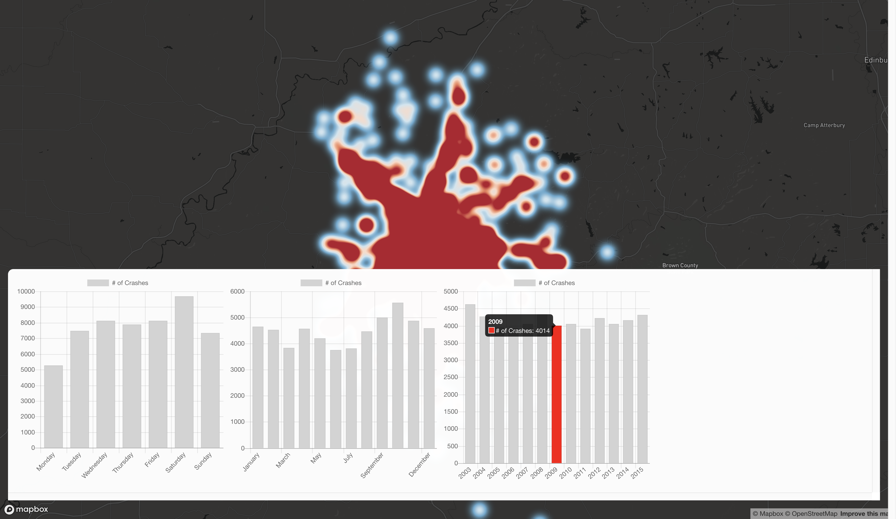

# Bloomington Vision Zero
## Mapbox Open Data Challenge (https://opendata-contest.splashthat.com/)



Features:
- Heatmap of Accidents (be patient, it takes to load)
- Identify accidents by weekday, month and year in bar chart

TODO:
- Click on bar in chart to "lock" selection
- Improve user feedback
- Toggle chart panel

Technologies used:
- React
- Mapbox GL
- Chart.js

### Usage
```
git clone https://github.com/felixerdy/BloomingtonVisionZero.git
cd BloomingtonVisionZero
yarn install
yarn run dev
```