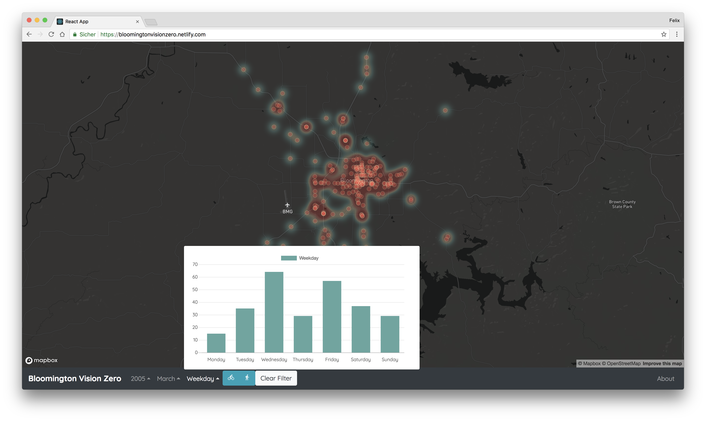

# Bloomington Vision Zero

## Mapbox Open Data Challenge (https://opendata-contest.splashthat.com/)



Features:

* Heatmap and locations of crashes
* Identify and filter crashes by weekday, month and year in bar chart
* Filter by crashes with cyclists / pedestrians involved

Technologies used:

* React
* Mapbox GL
* Chart.js

### Usage

```
git clone https://github.com/felixerdy/BloomingtonVisionZero.git
cd BloomingtonVisionZero
yarn install
yarn run dev
```
